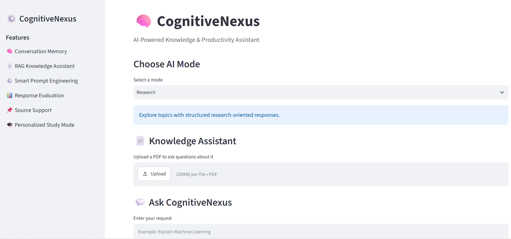
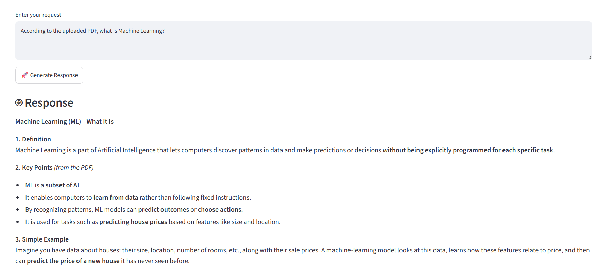
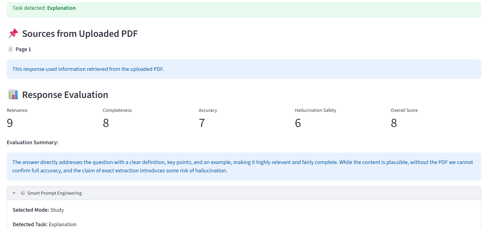
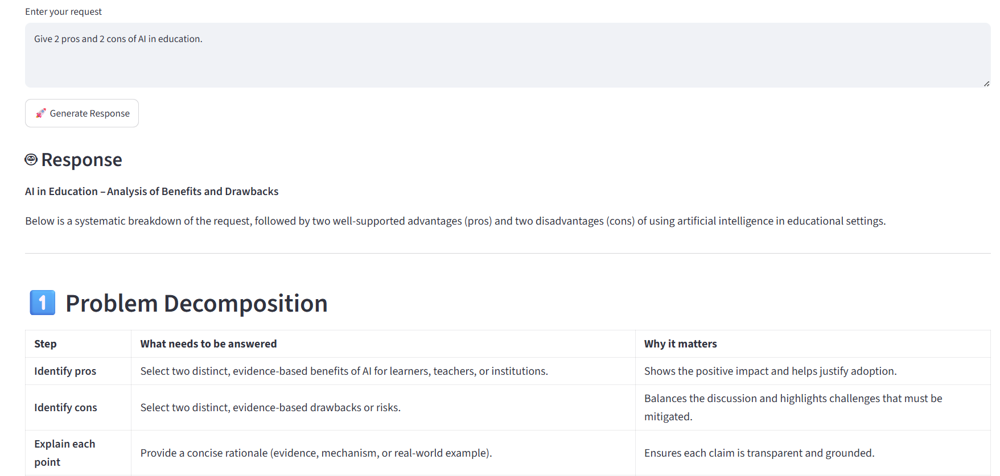
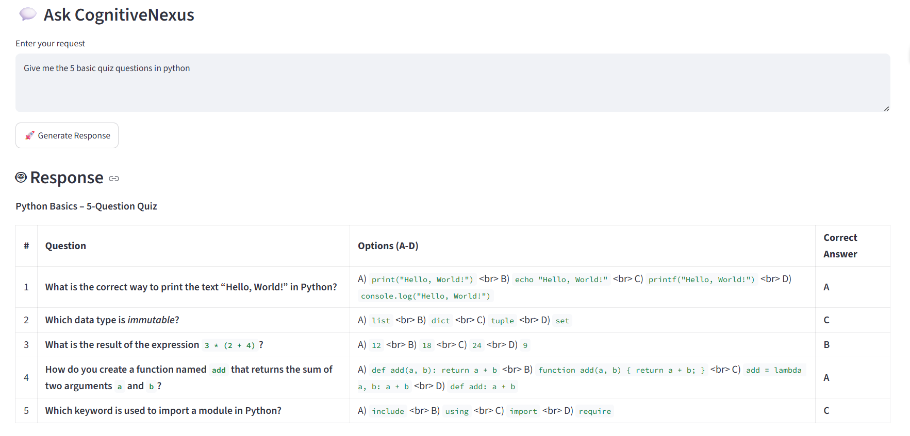
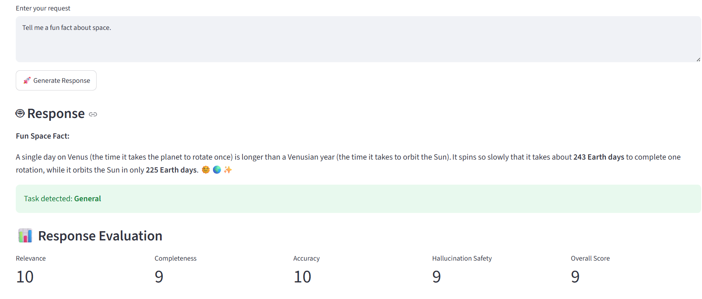

# 🧠 CognitiveNexus

## AI-Powered Knowledge & Productivity Assistant

CognitiveNexus is a Streamlit-based AI application designed to provide context-aware assistance for research, study, analysis, content creation, creative tasks, and general conversations.

The system combines Smart Prompt Engineering, Conversation Memory, RAG-based PDF Knowledge Assistance, Source Support, Response Evaluation, and Personalized Study Mode into one unified AI workspace.

---

## 🎯 Objectives

- Provide multiple AI assistance modes in one application.
- Automatically optimize prompts according to the user's task.
- Maintain conversation context during the active session.
- Allow users to ask questions from uploaded PDF documents.
- Provide source/page information for document-based answers.
- Evaluate generated responses using multiple quality criteria.
- Support personalized learning activities for students.

---

## ✨ Key Features

### 🧠 1. Conversation Memory

CognitiveNexus maintains conversation history during the active Streamlit session so that follow-up questions can use previous context.

The memory is session-based and is maintained while the active application session continues.

---

### 📄 2. RAG Knowledge Assistant

Users can upload a PDF and ask questions about its content.

The system:

1. Extracts text from the PDF.
2. Splits the text into smaller chunks.
3. Converts the text into TF-IDF vectors.
4. Uses cosine similarity to identify relevant chunks.
5. Provides the retrieved information as context to the AI model.
6. Generates an answer based on the retrieved document information.

This helps the application provide document-grounded answers.

---

### ⚙️ 3. Task-Specific Prompt Optimization

CognitiveNexus detects the user's intended task and adapts the prompt structure accordingly.

Supported task types include:

- Explanation
- Summary
- Quiz
- Flashcards
- Learning Plan
- Comparison
- Analysis
- Email
- Social Media Post
- Article
- Story
- Brainstorming
- General

This allows the same AI model to produce different response structures depending on the user's goal.

---

### 📌 4. Source Support

When a response uses information retrieved from an uploaded PDF, CognitiveNexus displays the relevant PDF page number.

This gives users a simple way to identify the source location of document-based information.

---

### 📊 5. Response Evaluation

Generated responses are evaluated using multiple quality criteria:

- Relevance
- Completeness
- Accuracy
- Hallucination Safety
- Overall Score

An evaluation summary is also displayed to help users understand the quality of the generated response.

---

### 🎓 6. Personalized Study Mode

Study Mode provides different learning activities for students:

- Explanation
- Summary
- Quiz
- Flashcards
- Learning Plan

This allows students to use CognitiveNexus for learning, revision, practice, and study planning.

---

## 🤖 AI Modes

CognitiveNexus provides six main AI modes:

| Mode | Purpose |
|------|---------|
| Research | Structured research-oriented responses |
| Study | Learning and revision assistance |
| Analysis | Logical analysis and comparison |
| Content | Professional content generation |
| Creative | Stories and creative ideas |
| General Chat | General-purpose conversation |

---

## 🏗️ System Architecture

```text
User Input
     ↓
Mode Selection
     ↓
Task Detection
     ↓
Smart Prompt Optimization
     ↓
Conversation Memory
     ↓
PDF Retrieval (when available)
     ↓
Structured Prompt
     ↓
Hugging Face Inference API
     ↓
AI Response
     ↓
Source Support
     ↓
Response Evaluation
     ↓
Final Output

---

## 📸 Screenshots

### 1. Main Interface


### 2. RAG Knowledge Assistant


### 3. Source Support & Response Evaluation


### 4. Smart Prompt Engineering


### 5. Personalized Study Mode


### 6. Creative Mode
